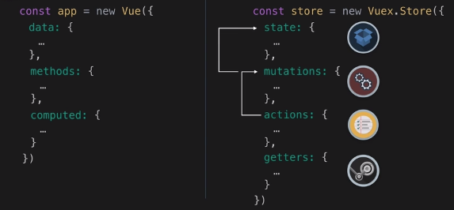

# What is VUex ?
It is a single source of truth, every components can communciate with Vuex and update any data regarding to Vuex.
When one component updates state, other components which use that state will automatically update it.

# What are mutations ?
Mutations are commit and track state changes.
Such as, ('SET_TODOS', todo_list[]) will change the state of the todo's in our state.
